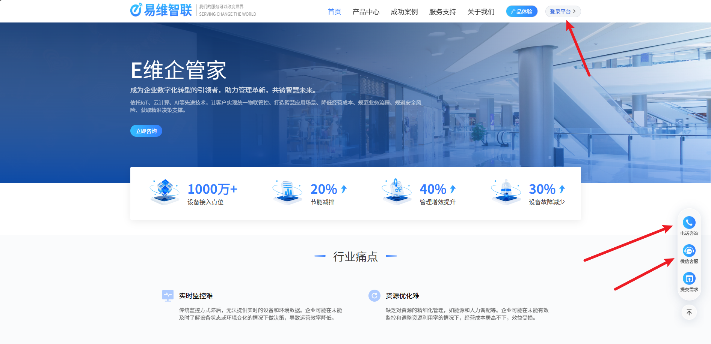
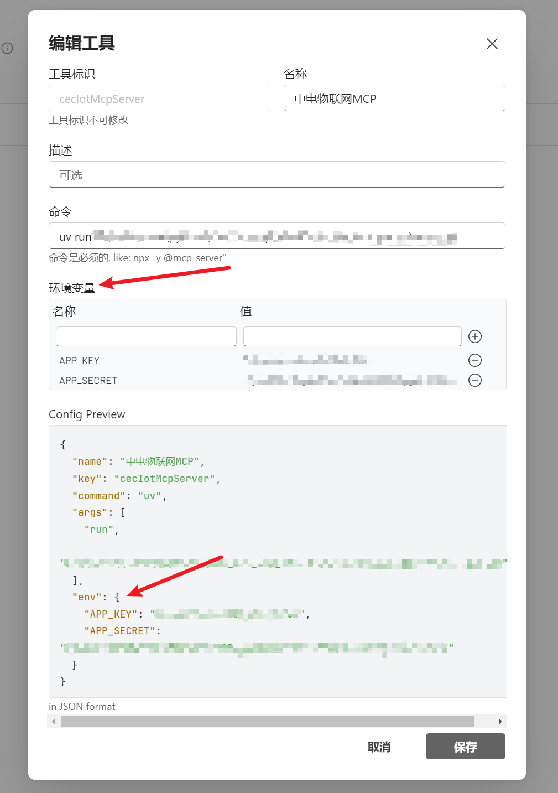

MMCP Server 产品名称：E维SaaS


## 版本信息
V1
## 产品描述
### 短描述
基于E维SaaS平台，实现设备管理及控制
### 长描述
为了实现与设备更友好的交互，上海中电E维SaaS MCP Server实现了设备管理及控制的服务接口，覆盖设备的新增，查看，控制操作场景。
#### 核心功能
* 新增GB/T-28181摄像头
*  获取摄像头当前图像
*  获取摄像头当前实时流播放地址
*  获取设备信息
* 控制设备
* 获取设备当前采集值
*
#### 适用场景
  * 以自然语言E维SaaS新增一个摄像头对象，获取对应GB/T-28181配置，例如：“在19楼新增一个摄像头”
  * 以自然语言控制查询设备开关状态，例如：“现在还有灯开着吗”
  * 以自然语言控制设备状态，例如：“关闭所有灯”


## 分类
物联网

## 标签
物联网，摄像头，设备

## Tools
本 MCP Server 产品提供一下 Tools（工具/能力）：

### Tool1: list_device_base_info()
#### 详细描述
查询设备基本信息（id、名称、序列号、区域、在离线）
#### 调试所需的输入参数：

输入：

    - area_ids(List[str]): 区域id列表，可以`结合全量获取区域` Tool 来获取目标区域列表
    - name(str): 设备名称

输出：
设备列表，markdown表格化输出下面的数据
```json
[{
	"id": "设备id",
	"name": "设备名称",
	"brandModelId": "品牌型号id",
	"sn": "序列号",
	"areaId": "区域id",
	"areaName": "区域名称",
	"status": "在离线枚举值",
	"statusName": "在离线状态描述"
}]
```
#### 最容易被唤起的 Prompt 示例
查询摄像头设备列表

### Tool2: get_area_info()
#### 详细描述
全量查询区域信息，支撑设备信息列表有区域描述的情况。返回的areaName 包含了区域的上下级关系
#### 调试所需的输入参数：

输入：无

输出：
区域列表，markdown表格化输出下面的数据
```json
[{
	"id": "区域id",
	"areaName": "区域名称（包含上下级关系）",
	"code": "区域编码"
}]
```
#### 最容易被唤起的 Prompt 示例
查询区域列表

### Tool3: add_camera()
#### 详细描述
新增国标GB/T-28181摄像头，并返回GB/T-28181配置
#### 调试所需的输入参数：

输入：

    - name(str): 摄像头名称，非必填，不填系统自动生成
    - sn(str): 摄像头序列号，非必填，不填系统自动生成
    - area_code(str)：区域编码，非必填，解析用户想新增的区域，并结合`查询区域信息`Tool 获取对应区域编码

输出：
GB/T-28181配置，markdown表格化输出下面的数据
```json
{
	"SIPUserAuthId": "33010501011320493620",
	"SIPServerIP": "192.168.4.113",
	"channels": [{
		"id": "33010501011320307642",
		"orderNum": "1"
	}],
	"SIPUserPasswd": "33010501011320631357",
	"SIPServerPort": "15060",
	"SIPServerDomain": "3402000000",
	"SIPServerId": "34020000002000000001",
	"SIPUserName": "33010501011320493620"
}
```
#### 最容易被唤起的 Prompt 示例
新增摄像头


### Tool4: get_camera_screenshot()
#### 详细描述
查看当前摄像头的图像信息，可以结合图像生成插件，直接列出摄像头的当前截图
#### 调试所需的输入参数：

输入：

    - area_ids(List[str]): 区域id列表

输出：
截图列表，markdown表格化输出下面的数据
```json
[{
	"id": "设备id",
	"code": "截图属性编码",
	"value": "截图地址url"
}]
```
#### 最容易被唤起的 Prompt 示例
查询19楼摄像头当前截图

### Tool5: get_play_url()
#### 详细描述
查看当前摄像头的实时流播放地址，可以结合播放器插件插件，播放摄像头的画面
#### 调试所需的输入参数：

输入：

    - area_ids(List[str]): 区域id列表

输出：
播放地址列表，markdown表格化输出下面的数据
```json
[{
	"id": "设备id",
	"code": "播放地址编码",
	"value": "播放地址url"
}]
```
#### 最容易被唤起的 Prompt 示例
查询19楼摄像头播放地址

### Tool6: get_asset_model_tool()
#### 详细描述
物模型是一个物理设备在云平台的抽象模型，例如某个品牌的灯，其包含了这个设备的属性值编码，属性则是可以进行采集控制的单元，例如灯的开关。此Tool是设备控制Tool、设备信息采集Tool的前置Tool
#### 调试所需的输入参数：

输入：

    - brand_model_ids(List[str]): 品牌型号id列表，可以通过`查询设备基本信息列表`Tool 进行查询

输出：
物模型属性列表，markdown表格化输出下面的数据
```json
[{
	"brandModelId": "品牌型号id",
	"code": "属性编码",
	"alias": "属性别名",
	"choseEnums": [{
		"enumCode": "1",
		"enumName": "开"
	},
	{
		"enumCode": "0",
		"enumName": "关"
	}]
}]
```
#### 最容易被唤起的 Prompt 示例
查询楼摄像设备物模型

### Tool7: control_device_tool()
#### 详细描述
批量下发设备控制指令。例如关闭19楼的所有灯。
#### 调试所需的输入参数：

输入：

    - controlInstructions(List[Dict[str,str]]): 控制指令列表，格式：[{"assetId":"设备id","code":"属性编码","value":"控制属性值"}]

输出：
控制结果，markdown表格化输出下面的数据
```json
[{
	'assetId': '1910506309824585730',
	'code': 'Switch',
	'value': '0',
	'resultCode': '00001',
	'resultmessage': '正在下发'
}]
```
#### 最容易被唤起的 Prompt 示例
开启所有灯

### Tool8: get_collect_data_by_id_codes_tool()
#### 详细描述
批量获取设备的属性值，用于判断当前设备处在什么状态，例如开关，当前温度等信息
#### 调试所需的输入参数：

输入：

    - device_ids(List[str]): 设备ID列表，通过`获取设备基本信息`Tool 获取到设备id列表
    - codes(List[str]): 属性编码列表，(1).通过`获取设备基本信息`Tool 获取到设备列表，(2). 获取设备列表的brandModelId列表，(3). 通过`获取品牌型号物模型信息`Tool 获取物模型属性信息

输出：
当前采集值信息，markdown表格化输出下面的数据
```json
[{
	'id': '1910506416276021249',
	'code': 'Switch',
	'value': '1'
}]
```
#### 最容易被唤起的 Prompt 示例
当前灯的开关状态

## 可适配平台
python

## 服务开通连接
http://www.eweiyun.com/home

## 鉴权方式
Token~~

## 安装部署
1. 打开服务开通连接

2. 联系客服开通对应的机构，并获取账号名、密码
3. 登录平台验证机构是否开通成功
4. 联系客服获取mcp的APP_KEY、APP_SECRET
5. 打开MCP工具，在环境变量中填入对应的APP_KEY、APP_SECRET



